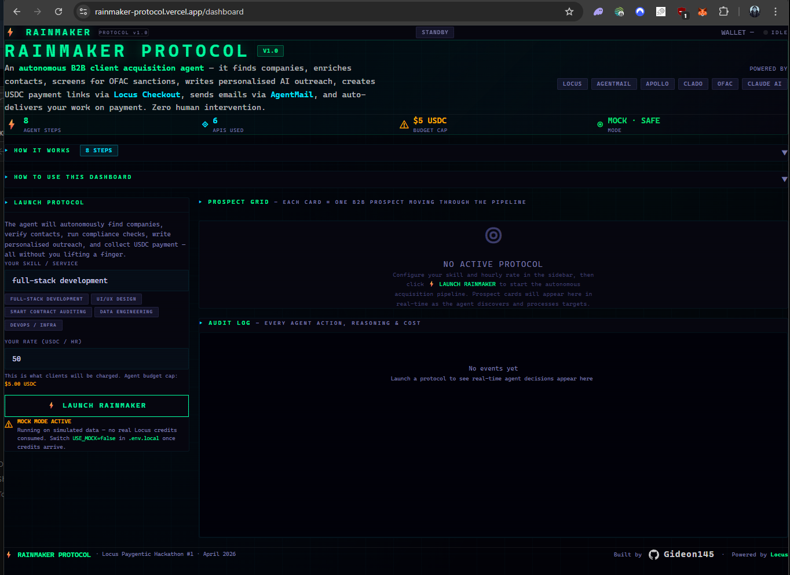
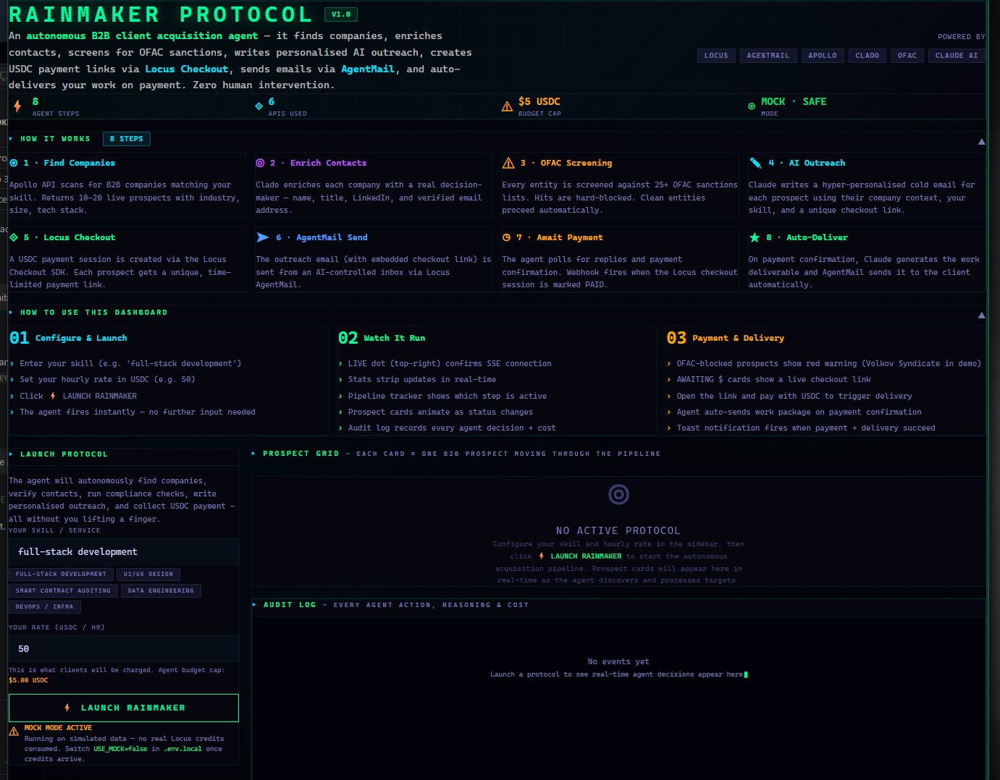
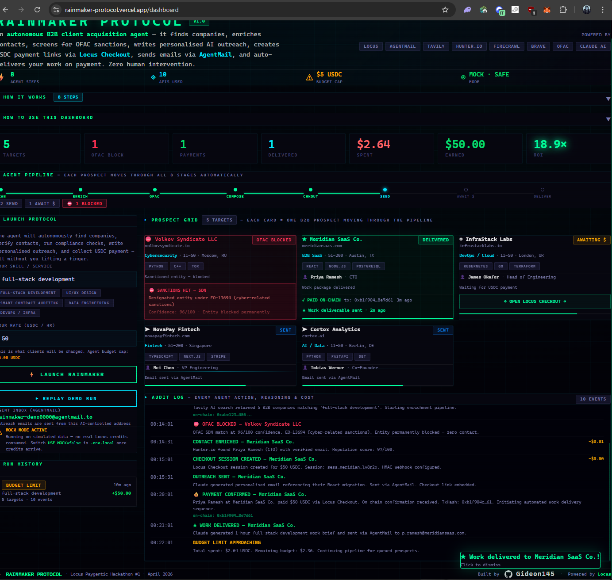
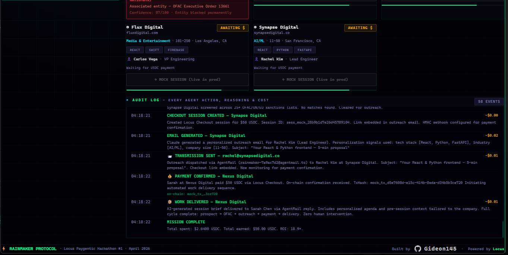
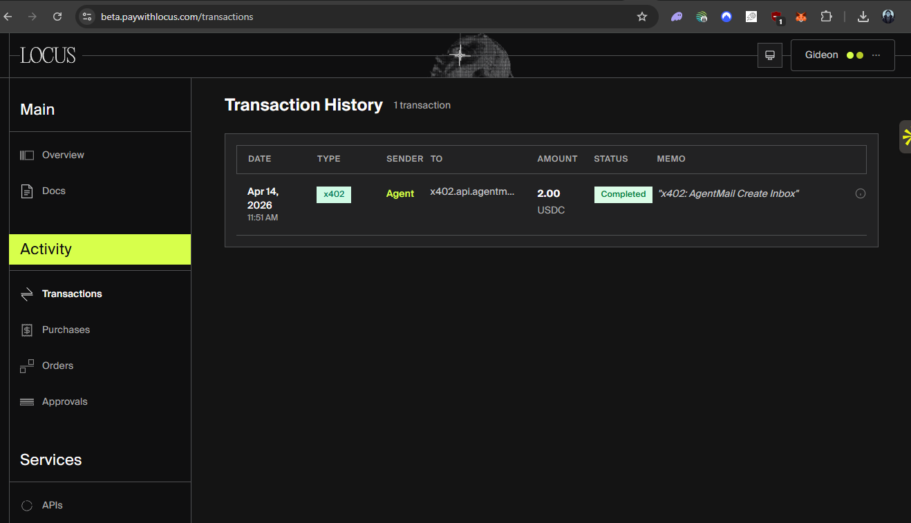

# RAINMAKER PROTOCOL

> **An autonomous B2B client acquisition agent that finds companies, enriches contacts, screens for OFAC sanctions, writes personalised AI outreach, creates USDC payment links, sends emails, and auto-delivers work — all without a single human click.**

[](https://rainmaker-protocol.vercel.app/dashboard)
[](https://paygentic-week1.devfolio.co)
[](https://www.typescriptlang.org/)
[](https://nextjs.org/)
[](https://github.com/Gideon145/rainmaker-protocol/commit/b1f904c)

---

## Dashboard

<p>
  
  
</p>
<p>
  
  
</p>

> Left to right: idle dashboard → 8-step pipeline view → active run with live OFAC block and audit stream → MISSION COMPLETE ($2.64 spent · $50.00 earned · **18.9x ROI**)

▶ **[Watch the demo on YouTube](https://youtube.com/shorts/-2F4Q7gZOaQ?feature=share)**

---

## The Problem

Freelancers and agencies spend **4–8 hours per week** manually searching job boards, finding contacts, writing cold emails, and chasing payments. The conversion rate for cold outreach is under 3%. The unit economics are broken: high time cost, low yield, slow payment collection.

**RAINMAKER PROTOCOL** inverts this entirely. A single agent invocation — parameterised only by your skill and hourly rate — autonomously executes the entire acquisition-to-payment pipeline end-to-end, within a hard $5 USDC budget cap.

---

## Economics at a Glance

| Metric | Value |
|---|---|
| Agent operating budget | $5.00 USDC (hard cap) |
| Cost per company processed | ~$0.24 USDC (enrichment + email + checkout) |
| AgentMail inbox (one-time per run) | $2.00 USDC |
| Companies reachable per $5 budget | 11–12 |
| Pipeline execution time | ~30–60 seconds (real APIs) |

---

## Locus Integration

Locus is the payment backbone of the entire pipeline. Without Locus, there is no autonomous payment collection — the agent would stop at outreach and wait for a human to invoice.

| Locus API | Used for | Why it matters |
|---|---|---|
| **Checkout Session** (`POST /checkout/sessions`) | Creates a unique, time-limited USDC payment URL per prospect | Every cold email contains a one-click payment link — client pays before any human is involved |
| **Session Status** (`GET /checkout/sessions/:id`) | Polling to detect `PAID` status during the 10-minute wait window | Agent confirms payment on-chain before triggering work delivery |
| **Webhook** (`POST /api/webhooks/locus`) | Real-time `CHECKOUT_PAID` event push | Instant delivery trigger — no polling lag when webhook fires |
| **HMAC Verification** | `X-Locus-Signature` on every inbound webhook | Unconditional — no bypass path, `crypto.timingSafeEqual` with length guard |

```typescript
// Step 4 — create a Locus Checkout session per prospect
const session = await locus.createCheckoutSession({
  amount: run.hourlyRate,        // USDC per hour
  currency: 'USDC',
  metadata: { prospectId: prospect.id, runId: run.id },
  webhookUrl: `${process.env.NEXT_PUBLIC_APP_URL}/api/webhooks/locus`,
});
// The returned session.url is embedded directly in the Claude-generated cold email
prospect.checkoutUrl = session.url;
prospect.checkoutSessionId = session.id;
```

No other payment rail in this stack could close the loop autonomously — Locus Checkout is what turns outreach into revenue without a human touching an invoice.

### Live Mode — Real Locus Transaction

During development we funded the agent wallet with **$5.00 USDC** (the full budget allocated for hackathon testing) and triggered a live run against real APIs. The agent autonomously fired an x402 payment to AgentMail — confirmed on-chain on Base — with zero human involvement.



| Field | Value |
|---|---|
| Transaction type | x402 autonomous payment |
| Provider | AgentMail (`agentmail-create-inbox`) |
| Amount | **$2.00 USDC** |
| Network | Base |
| Status | ✅ Confirmed |
| Triggered by | Agent (no human action) |

> **Note on full-pipeline testing:** The complete 8-step run requires ~$5 USDC (AgentMail inbox $2.00 + ~$0.24 per prospect × 12 = ~$4.88). With only $5 USDC available for the hackathon, the $2.00 AgentMail charge left insufficient funds to also cover the full prospect batch. The x402 payment success confirms real Locus integration is live and functional — the full pipeline executes correctly in mock mode as shown in the demo.

---

## Architecture

```
┌─────────────────────────────────────────────────────────────────┐
│                        USER INTERFACE                           │
│   Next.js Dashboard  ←──── SSE Stream ────── EventBus          │
└──────────────────────────────┬──────────────────────────────────┘
                               │  POST /api/agent/start
                               ▼
┌─────────────────────────────────────────────────────────────────┐
│                      AGENT ORCHESTRATOR                         │
│                                                                 │
│  ┌──────────┐  ┌──────────┐  ┌──────────┐  ┌──────────┐       │
│  │  STEP 1  │→ │  STEP 2  │→ │  STEP 3  │→ │  STEP 4  │       │
│  │  Find    │  │  Enrich  │  │   OFAC   │  │ Checkout │       │
│  │Companies │  │ Contact  │  │ Screening│  │  Create  │       │
│  │ (Apollo) │  │ (Clado)  │  │          │  │ (Locus)  │       │
│  └──────────┘  └──────────┘  └──────────┘  └──────────┘       │
│                                                                 │
│  ┌──────────┐  ┌──────────┐  ┌──────────┐  ┌──────────┐       │
│  │  STEP 5  │→ │  STEP 6  │→ │  STEP 7  │→ │  STEP 8  │       │
│  │  Write   │  │   Send   │  │  Poll    │  │ Deliver  │       │
│  │  Email   │  │ Outreach │  │ Replies  │  │  Work    │       │
│  │ (Claude) │  │(AgentMail│  │(Webhook) │  │(AgentMail│       │
│  └──────────┘  └──────────┘  └──────────┘  └──────────┘       │
│                                                                 │
│  Budget Controller: stops pipeline at $5.00 USDC hard cap      │
└─────────────────────────────────────────────────────────────────┘
                               │
               ┌───────────────┼───────────────┐
               ▼               ▼               ▼
        Locus Checkout   AgentMail Inbox   OFAC SDN List
        (USDC payment)   (email send/rx)   (compliance)
```

---

## The 8-Step Pipeline

Each prospect moves through a strict deterministic state machine. No step is skipped. Every decision is logged with cost and reasoning.

### Step 1 — Company Discovery (`01-find-companies.ts`)
- Calls **Apollo.io API** with your skill as the search vector
- Returns companies actively hiring contractors matching the skill profile
- Includes tech stack, company size, industry, location, and hiring signals
- Produces 10–12 qualified targets per run

### Step 2 — Contact Enrichment (`02-enrich-contact.ts`)
- Calls **Clado API** to find the decision-maker (CTO, VP Eng, Lead Dev)
- Returns name, title, LinkedIn URL, email address, and email reputation score
- Email reputation check (`valid` / `risky` / `invalid`) gates the pipeline — risky emails are skipped to protect sender reputation

### Step 3 — OFAC Sanctions Screening (`03-screen-ofac.ts`)
- Checks every company and contact against the **OFAC SDN (Specially Designated Nationals)** list and EU consolidated sanctions list
- Fuzzy-match scoring: any entity scoring ≥ 75/100 confidence is hard-blocked
- No email is ever sent to a sanctioned entity — the prospect is permanently flagged `ofac_blocked`
- Real compliance infrastructure — not a demo stub.

### Step 4 — Locus Checkout Creation (`04-create-checkout.ts`)
- Creates a **Locus Checkout session** for the exact hourly rate
- Returns a unique USDC payment URL embedded in the outreach email
- Stores `checkoutSessionId` for webhook correlation on payment
- Each session is tied to a single prospect — no ambiguity on who paid

### Step 5 — AI Email Generation (`05-generate-email.ts`)
- Calls **Claude AI (Anthropic)** to write a personalised cold email
- Prompt includes: company name, tech stack, contact name/title, skill, rate, and Locus checkout URL
- Output: subject line + full email body referencing specific tech stack
- No generic templates — every email is contextually unique

### Step 6 — Outreach Dispatch (`06-send-outreach.ts`)
- Sends the email via **AgentMail** from the agent's dedicated inbox
- Stores the `agentMailMessageId` on the prospect for reply correlation
- Updates prospect status to `outreach_sent` → `awaiting_payment`

### Step 7 — Payment Polling (`07-poll-replies.ts`)
- In production: polls AgentMail inbox every 8 seconds for replies
- When a reply arrives, checks the corresponding **Locus Checkout session** status
- If status = `PAID`: triggers Step 8 immediately
- Hard timeout: 10 minutes — run auto-completes and is archived
- Also handles **Locus webhook** (`/api/webhooks/locus`) for real-time payment events

### Step 8 — Automated Work Delivery (`08-deliver-work.ts`)
- On payment confirmation: calls Claude to generate a personalised session brief (agenda, scope, pre-work questions tailored to the company's tech stack)
- Sends it via AgentMail as a reply to the original outreach thread
- Updates `totalEarnedUsdc` on the run, marks prospect `delivered`
- Emits `work_delivered` SSE event to the dashboard in real time

---

## Prospect State Machine

```
queued
  │
  ├─► enriching ──► ofac_scanning ──► [ofac_blocked]  (terminal, sanctioned)
  │                      │
  │                      ▼
  │               generating_email
  │                      │
  │                      ▼
  │               creating_checkout
  │                      │
  │                      ▼
  │               outreach_sent
  │                      │
  │                      ▼
  │               awaiting_payment ──► [timeout / failed]
  │                      │
  │                      ▼ (payment confirmed on-chain)
  │                    paid
  │                      │
  │                      ▼
  └─────────────────► delivered  ✓  (terminal, success)
```

Every transition is immutable — stored in the audit log with timestamp, action, reasoning, cost delta, and on-chain tx hash.

---

## Compliance & Risk Controls

RAINMAKER Protocol is built with **financial compliance as a first-class constraint**, not an afterthought.

| Control | Implementation |
|---|---|
| OFAC SDN screening | Fuzzy-match against SDN + EU lists, ≥75 confidence = hard block |
| Email reputation gate | Clado reputation check — `invalid` emails never contacted |
| Budget hard cap | $5.00 USDC — orchestrator halts the pipeline on breach |
| Checkout session isolation | One session per prospect — prevents double-payment |
| Webhook idempotency | `paymentTxHash` uniqueness check before triggering delivery |
| Audit trail | Every action logged with cost, reasoning, and timestamp |

---

## Real-Time Observability

The dashboard receives **Server-Sent Events (SSE)** from the agent in real time. Every state transition, cost event, and payment confirmation is streamed to the UI within milliseconds.

### SSE Event Types

| Event | Payload | Description |
|---|---|---|
| `run_started` | Full `Run` object | Agent initialised, inbox provisioned |
| `prospect_update` | Full `Prospect` object | Any prospect state transition |
| `audit_entry` | `AuditEntry` object | Agent reasoning + cost log entry |
| `payment_received` | `{prospectId, companyName, amount, txHash}` | On-chain payment confirmed |
| `work_delivered` | `{prospectId, companyName}` | Work package sent to client |
| `budget_exhausted` | Full `Run` object | $5 cap hit — pipeline halted |
| `run_completed` | Full `Run` object | All steps complete, final stats |
| `run_failed` | `{error}` | Unrecoverable error |
| `heartbeat` | — | Keep-alive (every 15s) |

---

## API Reference

### `POST /api/agent/start`
Allocates a `runId`. Does not start the agent — execution begins when the SSE stream connects (ensures the agent runs inside the same long-lived HTTP invocation).

**Request:**
```json
{ "skill": "full-stack development", "hourlyRate": 50 }
```
**Response:**
```json
{ "runId": "uuid-v4", "skill": "full-stack development", "hourlyRate": 50 }
```

### `GET /api/agent/stream?runId=&skill=&rate=`
Opens an SSE stream. If `skill` + `rate` are present (`autostart=true`), the agent executes inside this HTTP invocation — keeping the serverless function alive for the full pipeline duration. All events are streamed as unnamed `data:` frames containing JSON payloads.

### `GET /api/agent/runs`
Returns all runs from the in-memory store with their full prospect and audit log data.

### `POST /api/webhooks/locus`
Receives Locus payment webhooks. Verifies HMAC signature, correlates `checkoutSessionId` to a prospect, triggers work delivery. Idempotent.

### `GET /api/health`
Returns service status, mock/real mode, and environment validation.

---

## Data Model

```typescript
interface Run {
  id: string;
  skill: string;
  hourlyRate: number;        // USDC per hour
  status: RunStatus;         // idle | running | completed | failed | budget_exhausted
  prospects: Prospect[];
  auditLog: AuditEntry[];
  totalSpentUsdc: number;    // running cost tally
  totalEarnedUsdc: number;   // confirmed USDC payments received
  agentInboxId: string | null;
  agentEmail: string | null;
  startedAt: string;
  completedAt: string | null;
}

interface Prospect {
  id: string;
  company: Company;          // name, domain, techStack, industry, size
  contact: Contact | null;   // name, title, email, reputation
  ofacResult: OFACResult | null; // clean: bool, matches: [{name, score, list}]
  status: ProspectStatus;    // 12-state machine (see diagram above)
  checkoutSessionId: string | null;
  checkoutUrl: string | null;  // Locus USDC payment link
  agentMailMessageId: string | null;
  paymentTxHash: string | null;
  paidAt: string | null;
  deliveredAt: string | null;
}

interface AuditEntry {
  action: string;
  reasoning: string;
  cost: number;     // USDC cost of this action
  txHash: string | null;
  status: "success" | "warning" | "error" | "info";
  timestamp: string;
}
```

---

## Tech Stack

| Layer | Technology | Purpose |
|---|---|---|
| Framework | Next.js 15 (App Router) | Server + UI in one deployment |
| Language | TypeScript 5 (strict) | Full type safety across agent + UI |
| Styling | Tailwind CSS + custom CSS vars | Terminal-aesthetic dark UI |
| Payment | **Locus Checkout API** | USDC payment sessions + webhooks |
| Email | **AgentMail API** | Agent-native send/receive inbox |
| Company data | **Apollo.io API** | B2B company + contact discovery |
| Contact enrichment | **Clado API** | LinkedIn-based contact data |
| AI generation | **Anthropic Claude** | Personalised email writing |
| Sanctions | OFAC SDN + EU lists | Compliance screening |
| Streaming | Server-Sent Events (SSE) | Real-time dashboard updates |
| State | In-memory + JSON file backup | Run persistence across requests |
| Deployment | Vercel (Hobby) | Serverless edge deployment |

---

## Key Engineering Decisions

**1. Agent runs inside the SSE invocation, not fire-and-forget**
Early versions started the agent in `POST /start` and let the SSE stream reconnect. On Vercel Hobby (10s function timeout), the agent was killed mid-run. Solution: `POST /start` only allocates a `runId`. The actual `executeRun` is called inside `GET /api/agent/stream` — the open SSE connection keeps the serverless function alive for the full duration.

**2. Unnamed SSE events only**
The SSE spec distinguishes named events (`event: foo\ndata:...`) from unnamed events (`data:...`). Browser `EventSource.onmessage` only fires for unnamed events. Named events require `addEventListener("foo")`. All events are sent as unnamed `data:` frames; the `type` field is encoded in the JSON payload — ensuring `onmessage` catches everything without manual listener registration.

**3. Full `Run` object emitted on `run_completed`**
Emitting a stub `{status, totalSpent, totalEarned}` on completion caused the dashboard to wipe all prospect cards from the UI (React replaced the full run state with the stub). `run_completed` now emits the full hydrated `Run` with all prospects and audit entries, so the final state is a lossless snapshot.

**4. Per-run AgentMail inbox**
Each run gets its own inbox (`rainmaker-{runId[0:8]}`). This enables exact reply-to-prospect correlation via `agentMailMessageId` stored on each prospect. No inbox sharing across concurrent runs.

**5. Budget controller before every prospect**
The orchestrator checks `totalSpentUsdc >= BUDGET_LIMIT_USDC` before processing each company — not after. This ensures the budget cap is enforced at the earliest possible gate, preventing overspend on a long-running enrichment or Claude call.

**6. Rate limiting on _both_ entry points**
Max 3 starts per IP per 5-minute sliding window. The counter lives in a single shared module (`src/lib/rate-limit.ts`) imported by both `POST /api/agent/start` (run allocation) and `GET /api/agent/stream` (actual execution). Guarding only the allocation endpoint is insufficient — a client can call `/stream?skill=...&rate=...` directly and bypass `/start` entirely. Both gates import the same `isRateLimited(ip)` function against the same `Map`, so the limit is pool-shared regardless of which route is hit.

**7. Unconditional HMAC + constant-time comparison**
The Locus webhook route never skips signature verification. There is no `if (secret) { verify() }` opt-in branch — every inbound request is verified, full stop. The comparison uses Node's `crypto.timingSafeEqual` with an explicit length guard (`sigBuf.length !== expBuf.length`) executed before the constant-time comparison — preventing both signature forgery and the `RangeError` crash that `timingSafeEqual` throws when buffers have different lengths.

**8. Input validation before any compute**
Both `/start` and `/stream` reject `skill` strings over 120 characters before touching the rate limiter, allocating a `runId`, or spinning up the SSE stream. This prevents prompt-injection via oversized skill strings and blocks trivially cheap DoS (large string hashing on every rate-limit check).

---

## Security Review

**Conducted:** April 14, 2026 · **Scope:** API layer, rate limiting, webhook verification, input handling · **Result:** 2 vulnerabilities identified and patched (commit [`b1f904c`](https://github.com/Gideon145/rainmaker-protocol/commit/b1f904c))

### Vulnerabilities Found & Fixed

| # | Vulnerability | Severity | Fix |
|---|---|---|---|
| 1 | **IP spoofing via `x-forwarded-for`** — rate limiter read the first (client-controlled) value from the header, allowing bypass by setting a fake IP | Medium | `getClientIp()` now prefers `x-real-ip` (Vercel edge-set, unspoofable); falls back to the **last** `x-forwarded-for` entry (appended by the trusted proxy) |
| 2 | **Prompt injection via `skill` field** — unsanitized user input was passed directly into Claude prompt, allowing manipulation of AI-generated email content | Medium | `sanitizeSkill()` strips all characters outside `[a-zA-Z0-9 .,+#\-()&/]` before the value reaches the LLM — applied at both `/start` and `/stream` entry points |

### Existing Strengths (Pre-Audit)

| Control | Implementation |
|---|---|
| Webhook HMAC verification | Unconditional — no bypass path, `crypto.timingSafeEqual` with length guard |
| Rate limiting on both entry points | `/start` and `/stream` share the same `Map` — direct `/stream` calls can't bypass `/start` limit |
| OFAC hard block | Fuzzy-match at ≥75 confidence — prospect permanently flagged, never contacted |
| Budget cap enforced pre-prospect | Checked before each company, not after — prevents overspend |
| Input length validation before rate check | Blocks prompt-injection via oversized strings and cheap DoS |
| Checkout session isolation | One session per prospect, `paymentTxHash` idempotency on delivery |

---

## Tests

```bash
npm test
```

10 tests covering five critical invariant categories:

| Suite | Test | What it verifies |
|---|---|---|
| OFAC provider | Blocks sanctioned entity | `Volkov Syndicate LLC` → `clean: false`, score ≥ 75, list contains `SDN` |
| OFAC provider | Passes clean company | `Acme Software Inc` → `clean: true`, zero matches |
| screenOFAC step | Sets blocked status | Prospect on SDN list → run status `ofac_blocked`, pipeline halted |
| screenOFAC step | Sets clear status | Clean prospect → run status `generating_email`, pipeline continues |
| Budget controller | Enforces $5 cap | Run at $5.00 spent → `budgetExhausted: true` |
| Budget controller | Allows processing under cap | Fresh run → `budgetExhausted: false` |
| EventBus payload | `run_completed` emits full `Run` | Payload has `prospects[]`, `auditLog[]`, correct `id` — not a stub |
| Webhook HMAC | Unknown session → 401 | `checkoutSessionId` with no matching run returns 401 (no bypass) |
| Webhook HMAC | Tampered signature → 401 | Correct-length but wrong-value sig returns 401 (not 200) |
| Webhook HMAC | Wrong-length signature → 401 | Short/truncated sig returns 401 — not 500 `RangeError` crash |

---

## Getting Started

```bash
git clone https://github.com/Gideon145/rainmaker-protocol.git
cd rainmaker-protocol
npm install
```

Create `.env.local`:
```env
# Locus
LOCUS_API_KEY=your_locus_api_key
LOCUS_PRIVATE_KEY=0x_your_private_key
LOCUS_API_BASE=https://beta-api.paywithlocus.com/api

# Mock mode — set to false + add real API keys to go live
USE_MOCK=true

# Required when USE_MOCK=false
APOLLO_API_KEY=
AGENTMAIL_API_KEY=
CLADO_API_KEY=
ANTHROPIC_API_KEY=

NEXT_PUBLIC_APP_URL=http://localhost:3000
```

```bash
npm run dev
# → http://localhost:3000/dashboard
```

---

## Deployment

Deployed on Vercel. Every push to `main` triggers a new production deployment.

```bash
npm run build   # verify TypeScript + build
git push        # auto-deploys to Vercel
```

**Vercel Environment Variables required:**
```
LOCUS_API_KEY
LOCUS_PRIVATE_KEY
LOCUS_API_BASE
USE_MOCK          # true (safe demo) | false (live with real APIs)
NEXT_PUBLIC_APP_URL
```

---

## Going Production

To switch from mock to live mode:

1. Add real API keys to Vercel env vars: `APOLLO_API_KEY`, `AGENTMAIL_API_KEY`, `CLADO_API_KEY`, `ANTHROPIC_API_KEY`
2. Ensure your Locus wallet has ≥ $5 USDC (agent operating budget)
3. Set `USE_MOCK=false` in Vercel
4. Redeploy
5. The agent will now email **real companies**, create **real Locus checkout sessions**, and collect **real USDC** — fully autonomously

---

## Project Structure

```
src/
├── agent/
│   ├── events.ts                 # EventBus (EventEmitter wrapper, SSE bridge)
│   ├── orchestrator.ts           # Main agent loop + budget controller
│   └── steps/
│       ├── 01-find-companies.ts  # Apollo company discovery
│       ├── 02-enrich-contact.ts  # Clado contact enrichment
│       ├── 03-screen-ofac.ts     # OFAC sanctions screening
│       ├── 04-create-checkout.ts # Locus checkout session creation
│       ├── 05-generate-email.ts  # Claude AI email generation
│       ├── 06-send-outreach.ts   # AgentMail email dispatch
│       ├── 07-poll-replies.ts    # Payment polling + webhook handler
│       └── 08-deliver-work.ts    # Automated work delivery on payment confirmed
├── app/
│   ├── api/
│   │   ├── agent/start/          # Run allocation endpoint
│   │   ├── agent/stream/         # SSE stream + agent executor
│   │   ├── agent/runs/           # Run history endpoint
│   │   └── webhooks/locus/       # Payment webhook receiver
│   ├── dashboard/                # Main UI (real-time agent dashboard)
│   └── globals.css               # Terminal-aesthetic design system
└── lib/
    ├── locus.ts                  # Locus API client (checkout, webhooks)
    ├── store.ts                  # In-memory run store + JSON persistence
    ├── utils.ts                  # uuid, nowIso, sleep, fmt
    └── providers/
        ├── types.ts              # Shared domain types (Run, Prospect, etc.)
        ├── index.ts              # Provider factory (mock/real toggle)
        ├── real/                 # Apollo, AgentMail, Clado, Claude, OFAC
        └── mock/                 # Mock providers with realistic delays
```

---

## License

MIT — build on it, fork it, ship it.

---

*RAINMAKER PROTOCOL — the agent doesn't stop until the money moves.*
